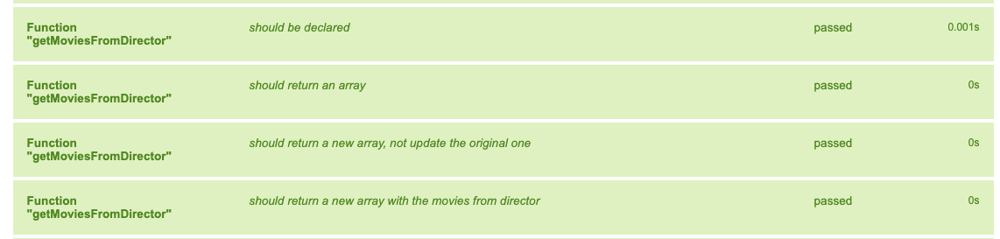

# 🎬 Sprint 3 – Movie Management Tool

## 📋 Project Overview

This project is part of the IT Academy's Sprint 3, focusing on building the core logic for a movie management web application. The goal is to implement functions that filter, sort, and analyze a dataset of movies, all of these while passing tests using Jest framework.

## 🚀 Getting Started

### Prerequisites

- Node.js installed on your machine.
- A code editor like Visual Studio Code.

### Installation

1. Clone the repository:

   ```bash
   git clone https://github.com/angelesgonzalez/S3-Testing-Level-3.git
   cd S3-Testing-Level-3
   ```

2. Install dependencies:

   ```bash
   npm install
   ```

### Running Tests

To run the test suite and verify your implementations:

```bash
npm test
```

---

## 🧪 Exercises

### 🟢 Level 1

#### ✅ Exercise 1: Get All Directors

**Function:** `getAllDirectors(movies)`

**Description:**  
Return an array containing the names of all directors from the movie dataset.

**Hint:**  
Use the `.map()` method to extract the `director` property from each movie object.

**Test Screenshot:**  


---

#### ✅ Exercise 2: Get Movies from a Specific Director

**Function:** `getMoviesFromDirector(movies, director)`

**Description:**  
Return an array of movies directed by the specified director.

**Hint:**  
Use the `.filter()` method to select movies where the `director` matches the given name.

**Test Screenshot:**  


---

#### ✅ Exercise 3: Calculate Average Score of a Director's Movies

**Function:** `moviesAverageOfDirector(movies, director)`

**Description:**  
Calculate and return the average score of all movies directed by the specified director, rounded to two decimal places.

**Hint:**  
Use `.filter()` to get the director's movies, then `.reduce()` to sum their scores, and finally divide by the number of movies.

**Test Screenshot:**  


---

#### ✅ Exercise 4: Alphabetical Order of Movie Titles

**Function:** `orderAlphabetically(movies)`

**Description:**  
Return an array of the first 20 movie titles sorted alphabetically.

**Hint:**  
Use `.map()` to extract titles, `.sort()` to sort them, and `.slice()` to get the first 20.

**Test Screenshot:**  


---

#### ✅ Exercise 5: Order Movies by Year

**Function:** `orderByYear(movies)`

**Description:**  
Return an array of movies sorted by year in ascending order. If two movies have the same year, sort them alphabetically by title.

**Hint:**  
Use `.sort()` with a custom comparator that first compares years and then titles.

**Test Screenshot:**  


---

#### ✅ Exercise 6: Average Score by Genre

**Function:** `moviesAverageByCategory(movies, genre)`

**Description:**  
Calculate and return the average score of movies in the specified genre, rounded to two decimal places.

**Hint:**  
Use `.filter()` to select movies that include the genre, then `.reduce()` to sum their scores.

**Test Screenshot:**  


---

### 🟡 Level 2

#### ✅ Exercise 7: Convert Movie Durations to Minutes

**Function:** `hoursToMinutes(movies)`

**Description:**  
Convert the `duration` property of each movie from a string format (e.g., "2h 34min") to an integer representing the total number of minutes.

**Hint:**  
Use string manipulation methods to parse hours and minutes, then calculate the total duration in minutes.

**Test Screenshot:**  


---

### 🔴 Level 3

#### ✅ Exercise 8: Best Film of the Year

**Function:** `bestFilmOfYear(movies, year)`

**Description:**  
Return the movie with the highest score from the specified year.

**Hint:**  
Use `.filter()` to select movies from the given year, then `.reduce()` to find the one with the highest score.

**Test Screenshot:**  


---

## 📁 Directory Structure

```
S3-Testing-Level-1/
├── src/
│   └── index.js
├── tests/
│   └── films.spec.js
├── screenshots/
│   ├── exercise1.png
│   ├── exercise2.png
│   └── ...
├── package.json
└── README.md
```
